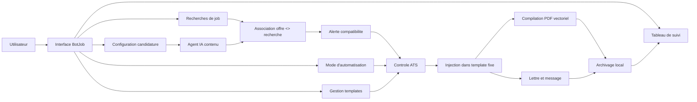
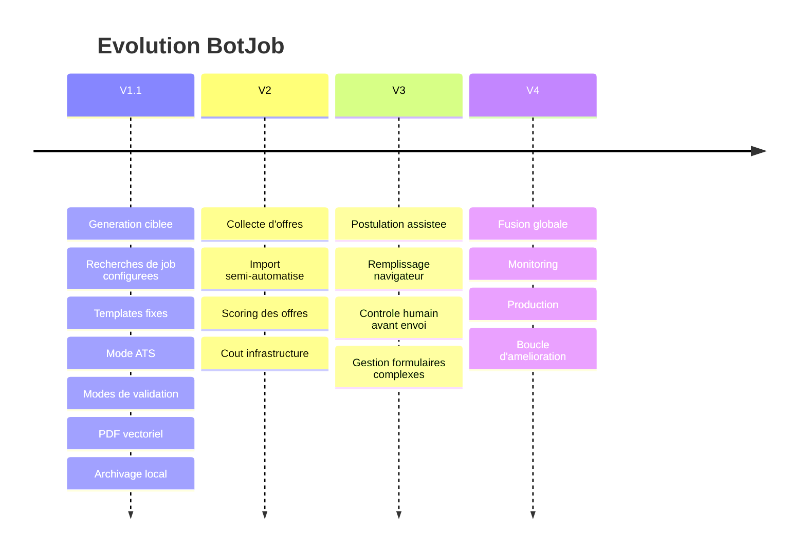
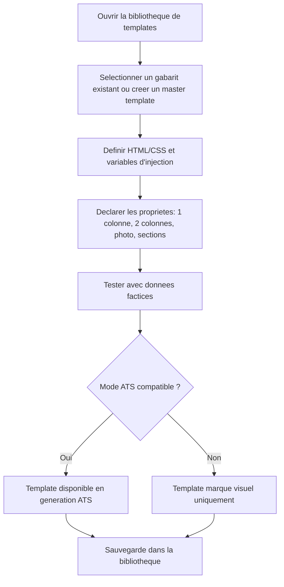
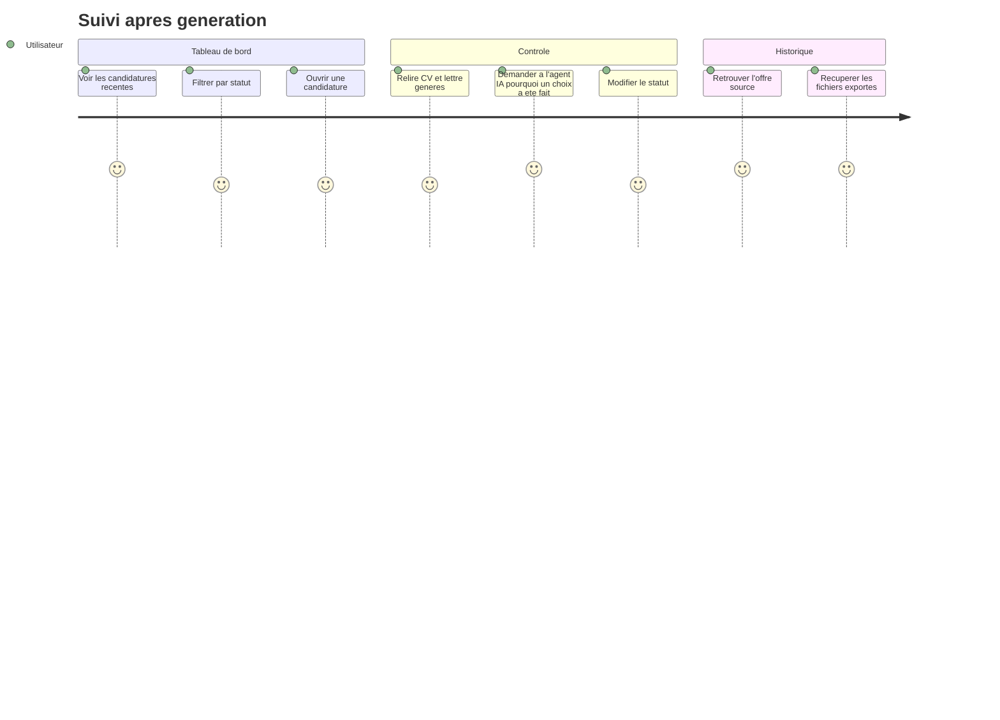
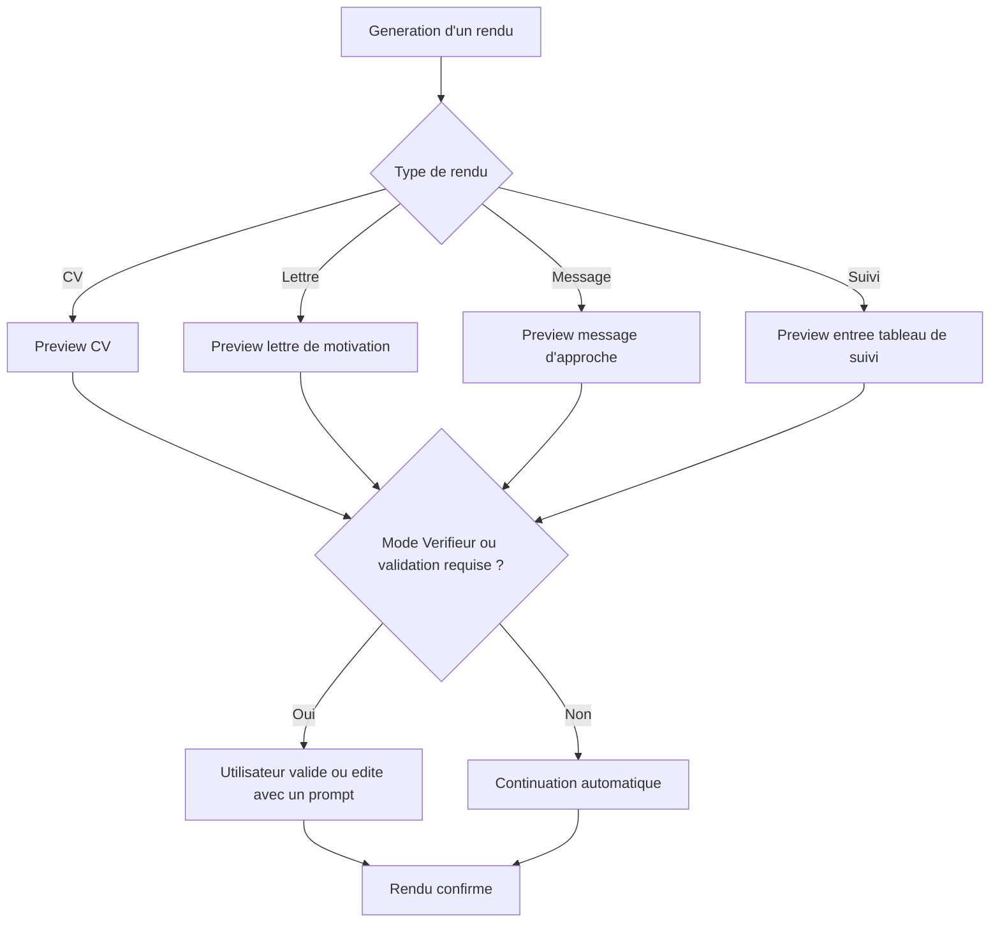
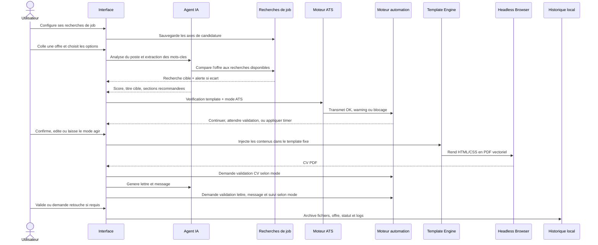

# BotJob - Vision Produit V1.1

> [!abstract]
> **BotJob** est un assistant de candidature qui transforme une offre d'emploi en dossier de candidature cible: CV PDF vectoriel conforme ATS, lettre de motivation, message d'approche et trace dans un tableau de suivi.

## Lecture Rapide

BotJob V1.1 doit d'abord reussir une chose: produire des candidatures propres, lisibles par les ATS et assez controlees pour ne pas casser la mise en page. L'IA travaille sur le fond. Les templates gardent la forme stable.

La version 1.1 ne cherche pas encore a automatiser toute la recherche d'emploi. Elle pose le socle: configuration, generation, controle ATS, export PDF, archivage. Les phases V2 a V4 pourront ensuite ajouter la collecte d'offres, la postulation assistee et le monitoring.

## Promesse Utilisateur

**Je definis mes recherches de job, je colle une offre, BotJob l'associe au bon axe de candidature, adapte les contenus et me signale les ecarts avant export.**

Les trois attentes majeures:

- gagner du temps sans perdre le controle;
- produire un CV lisible par les ATS;
- adapter chaque candidature a l'offre reelle, meme si elle sort du cadre de recherche initial;
- garder un historique clair de chaque candidature.

## Perimetre Fonctionnel V1.1

| Bloc | Role | Sortie attendue |
| --- | --- | --- |
| Tableau de suivi | Piloter les candidatures | Statuts, historique, fichiers generes |
| Agent IA lateral | Interroger et ajuster | Reponses contextualisees, retouches manuelles |
| Recherches de job | Definir les axes de candidature | Liste de cibles: developpeur logiciel, IA, embarque, job etudiant, etc. |
| Authentification | Creer et securiser les comptes | Email, username, mot de passe, validation email, OAuth Google/Apple |
| Profil utilisateur | Personnaliser le compte | Nom, prenom, telephone, pays du numero, avatar interne |
| Gestion des templates | Stabiliser la mise en page | Bibliotheque, master template, variables |
| Formulaire pre-generation | Personnaliser avant export | Template, photo, titre, projets prioritaires |
| Controle ATS | Eviter les rejets techniques | Alertes, nettoyage, regles strictes |
| Modes d'automatisation | Regler le niveau de validation | YOLO, Assiste, Strict, Verifieur |
| Compilation PDF | Generer les fichiers finaux | PDF vectoriel, lettre, message |
| Archivage | Tracer la candidature | Log local, fichiers lies a l'offre |

## Authentification et Profil

| Element | Decision V1 | Evolution |
| --- | --- | --- |
| Inscription classique | Email, username, mot de passe, nom, prenom, telephone, pays du numero | Verification telephone via WhatsApp en V2 |
| Validation email | Lien de confirmation obligatoire avant activation complete du compte | Relance automatique si email non confirme |
| Connexion | Username ou email + mot de passe | Ajout de politiques anti-abus si SaaS public |
| OAuth | Google et Apple | Autres fournisseurs seulement si besoin produit |
| Avatar | Choix dans une galerie interne | Banque d'images fournie et enrichie progressivement |
| Upload avatar | Interdit en V1 | Possible plus tard avec moderation et stockage controle |

> [!warning]
> Le numero de telephone, le nom et le prenom sont des donnees personnelles. Leur collecte doit etre justifiee par la finalite du service: identification du compte, securite, personnalisation et futures fonctions de verification.

## Banque d'Avatars

La V1 utilise une banque d'avatars locale et compressee. L'utilisateur ne peut pas importer sa propre image depuis l'interface. Il selectionne uniquement un avatar parmi les images disponibles.

| Famille | Usage |
| --- | --- |
| Anime | Avatars expressifs et stylises |
| Cartoon | Avatars accessibles et grand public |
| Professionnel | Avatars neutres type profil SaaS |
| Custom | Images fournies manuellement par AhmiSVG avant publication |

Le pipeline d'assets est documente dans `docs/avatar-assets.md`. Les sources se placent dans `assets/avatars/source/inbox`, puis le script `scripts/avatars/build-avatar-bank.mjs` genere les images WebP optimisees et le manifeste `assets/avatars/avatars.manifest.json`.

## Architecture Produit

## Roadmap Produit

## User Flow Principal - Generer une Candidature

```mermaid
flowchart TD
    A["Depart: l'utilisateur ouvre BotJob"] --> B["Colle l'URL, l'entreprise et le texte de l'offre"]
    B --> C["BotJob extrait titre, mots-cles, competences et contraintes"]
    C --> D["Comparaison avec la liste des recherches de job"]
    D --> E{"Compatible avec la recherche selectionnee ?"}
    E -->|Oui| F["Recherche cible confirmee"]
    E -->|Non| G["Alerte: offre non compatible avec la recherche selectionnee"]
    G --> H["BotJob propose la recherche la plus proche ou une cible temporaire"]
    F --> I["Ouverture du formulaire pre-generation"]
    H --> I
    I --> J["Choix template, photo, titre cible, projets, mode ATS et mode d'automatisation"]
    J --> K{"Mode ATS active ?"}
    K -->|Non| L["Generation standard"]
    K -->|Oui| M["Controle strict: 1 colonne, texte brut, nettoyage caracteres"]
    M --> N{"Template compatible ATS ?"}
    N -->|Non| O["Alerte critique UI geree selon le mode d'automatisation"]
    O --> P{"Mode courant ?"}
    P -->|YOLO| L
    P -->|Assiste: pas de reponse en 1 min| L
    P -->|Strict| Q["Pause jusqu'a validation ou correction utilisateur"]
    P -->|Verifieur| Q
    Q --> R["Correction template ou confirmation explicite"]
    R --> M
    N -->|Oui| L
    L --> S["Injection IA dans le template fixe"]
    S --> T["Generation CV"]
    T --> U{"Validation requise pour le CV ?"}
    U -->|Oui| V["Preview CV: valider ou editer par prompt"]
    U -->|Non| W["Generation lettre de motivation"]
    V --> W
    W --> X{"Validation requise pour la lettre ?"}
    X -->|Oui| Y["Preview lettre: valider ou editer par prompt"]
    X -->|Non| AA["Generation message d'approche"]
    Y --> AA
    AA --> AB{"Validation requise pour le message ?"}
    AB -->|Oui| AC["Preview message: valider ou editer par prompt"]
    AB -->|Non| AD["Mise a jour tableau de suivi"]
    AC --> AD
    AD --> AE{"Validation requise pour le suivi ?"}
    AE -->|Oui| AF["Preview entree de suivi: valider ou editer"]
    AE -->|Non| AG["Archivage final"]
    AF --> AG
```

## Parcours Utilisateur 1 - Configurer les Recherches de Job

| Etape | Action utilisateur | Reponse systeme | Point de vigilance |
| --- | --- | --- | --- |
| 1 | Cree une recherche | BotJob enregistre un axe comme `Developpeur logiciel`, `Developpeur IA`, `Systeme embarque`, `Job etudiant temps partiel` | Une recherche doit decrire un objectif, pas seulement un mot-cle |
| 2 | Definit les criteres | L'utilisateur ajoute titre vise, competences, exclusions, niveau, disponibilite | Les jobs alimentaires peuvent coexister avec les recherches tech |
| 3 | Colle une offre | BotJob compare l'offre a toutes les recherches | L'offre n'est pas rejetee si elle sort du cadre |
| 4 | Consulte l'association | Le systeme selectionne la recherche la plus compatible | Une alerte apparait si l'offre ne correspond pas a la recherche active |
| 5 | Valide ou change la cible | La candidature s'adapte a la recherche retenue | La suite de generation utilise cette cible comme contexte |

## Parcours Utilisateur 2 - Candidature Controlee

| Etape | Action utilisateur | Reponse systeme | Point de vigilance |
| --- | --- | --- | --- |
| 1 | Colle une offre | BotJob extrait les donnees utiles | L'offre doit rester lisible meme si le texte est brut |
| 2 | Verifie la recherche associee | Le systeme rattache l'offre a la meilleure cible | Alerte si l'offre ne correspond pas a la recherche selectionnee |
| 3 | Choisit template, photo, titre, projets et mode | L'interface prepare la candidature | Les options doivent etre visibles avant generation |
| 4 | Active le mode ATS | BotJob applique les contraintes strictes | Alerte forte si template 2 colonnes |
| 5 | Lance la generation | L'IA injecte seulement le contenu | Le HTML/CSS du template reste verrouille |
| 6 | Relit les rendus selon le mode choisi | L'utilisateur valide ou edite le CV, la lettre, le message et le suivi | Le mode Verifieur impose une validation a chaque rendu |
| 7 | Valide | Fichiers exportes et candidature archivee | Le suivi doit etre immediatement mis a jour |

## Parcours Utilisateur 3 - Creer ou Modifier un Template

## Parcours Utilisateur 4 - Suivre les Candidatures

## Modes d'Automatisation

| Mode | Comportement | Quand l'utiliser |
| --- | --- | --- |
| YOLO | Les alertes restent visuelles. Le systeme continue sans bloquer, sauf erreur technique impossible a contourner. | Candidatures en volume, faible besoin de controle manuel |
| Assiste | Les problemes demandent une confirmation. Sans reponse utilisateur apres 1 minute, BotJob continue avec l'option par defaut. | Mode quotidien equilibre entre vitesse et securite |
| Strict | Aucun timer. En cas de probleme ou incompatibilite, BotJob attend une validation ou une correction explicite. | Candidature importante, offre sensible, risque ATS |
| Verifieur | Validation obligatoire a chaque rendu, meme si tous les controles sont bons: CV, lettre, message, entree de suivi. | Construction fine d'une candidature prioritaire |

### Regles de Validation par Rendu

## Sequence Technique V1.1

## Fonctions Internes Attendues

Comme la logique IA, les donnees de candidature et le tableau de suivi vivent dans le meme systeme, BotJob doit exposer des fonctions internes reutilisables par l'agent:

| Fonction interne | Role |
| --- | --- |
| `matchJobSearch(offer, jobSearches)` | Compare une offre avec la liste des recherches et retourne la cible la plus pertinente |
| `raiseCompatibilityAlert(offer, selectedSearch, bestSearch)` | Genere l'alerte si l'offre ne correspond pas a la recherche selectionnee |
| `resolveAutomationGate(issue, mode)` | Decide si BotJob continue, attend, applique un timer ou bloque |
| `generateCvDraft(context)` | Produit le contenu CV injecte dans le template fixe |
| `generateMotivationLetter(context)` | Produit la lettre de motivation adaptee a l'offre |
| `generateApproachMessage(context)` | Produit le message court d'approche |
| `requestArtifactApproval(artifact, mode)` | Demande validation ou edition selon le mode choisi |
| `updateApplicationTracking(application)` | Met a jour le tableau de suivi avec fichiers, statut et logs |

## Regles Produit Non Negociables

> [!important]
> Le template gere la forme. L'IA gere le contenu. Cette separation protege la mise en page et la compatibilite ATS.

- L'utilisateur doit pouvoir creer plusieurs recherches de job: tech, IA, embarque, alternance, job etudiant, job alimentaire, etc.
- Une offre non compatible avec la recherche selectionnee ne doit pas etre rejetee automatiquement. Elle doit generer une alerte et rester adaptable.
- BotJob doit proposer la recherche la plus proche lorsque l'offre correspond mieux a un autre axe de candidature.
- Un CV ATS doit rester textuel, vectoriel, selectionnable et parsable.
- Le mode ATS doit privilegier les gabarits 1 colonne.
- Un gabarit 2 colonnes avec mode ATS active doit declencher une alerte explicite.
- Les barres de progression, tableaux imbriques et caracteres non standards doivent etre nettoyes en mode ATS.
- Le seuil de pertinence de 80% sert a alerter et orienter, pas a bloquer automatiquement.
- L'utilisateur doit pouvoir modifier le titre cible, la photo et les projets avant generation.
- Le mode d'automatisation doit determiner les pauses, timers et validations obligatoires.
- En mode Verifieur, aucune candidature ne doit etre consideree terminee sans validation du CV, de la lettre, du message et de l'entree de suivi.

## Ecrans Principaux a Designer

| Ecran | Objectif | Controles cles |
| --- | --- | --- |
| Dashboard | Voir l'etat global | Filtres, statuts, recherche, action rapide |
| Recherches de job | Gerer les axes de candidature | Cibles, criteres, priorite, exclusions, statut actif |
| Detail candidature | Comprendre une candidature | Offre source, score, fichiers, notes IA |
| Pre-generation | Configurer avant export | Recherche cible, template, photo, titre, projets, mode ATS, mode automation |
| Preview | Relire et valider | Apercu PDF, lettre, message, retouches |
| Templates | Gerer les gabarits | Bibliotheque, editeur, variables, compatibilite ATS |
| Agent IA | Dialoguer avec le systeme | Questions, retouches, explications |

## Etats et Alertes Prioritaires

| Situation | Message UI attendu | Niveau |
| --- | --- | --- |
| Offre hors recherche selectionnee | Attention: cette offre ne correspond pas a la recherche selectionnee. BotJob propose une cible plus proche. | Warning |
| Score < 80% sur toutes les recherches | Offre faible compatibilite avec les recherches configurees. La candidature sera adaptee, mais l'angle doit etre verifie. | Warning |
| Mode ATS + 2 colonnes | Risque de mauvaise extraction par les ATS. Choisissez un gabarit 1 colonne. | Critique |
| Mode Assiste + absence de reponse | Aucune reponse apres 1 minute. BotJob continue avec l'option par defaut. | Info |
| Mode Strict + probleme detecte | Validation obligatoire avant de continuer. | Bloquant |
| Mode Verifieur | Validation requise pour chaque rendu genere. | Info |
| Photo desactivee | Le template sera reajuste sans espace vide. | Info |
| Template invalide | Variables manquantes ou CSS non compatible export PDF. | Bloquant |
| PDF non vectoriel | Export refuse: le texte doit rester selectionnable. | Bloquant |

## Definition de Reussite V1.1

BotJob V1.1 est reussi si l'utilisateur peut:

- coller une offre et obtenir une analyse claire;
- creer plusieurs recherches de job et associer chaque offre a la bonne cible;
- recevoir une alerte quand l'offre ne correspond pas a la recherche selectionnee, sans bloquer l'adaptation de la candidature;
- choisir un template et ses options sans ambiguite;
- choisir un mode d'automatisation adapte au niveau de controle voulu;
- recevoir une alerte ATS au bon moment;
- generer un CV PDF vectoriel propre;
- exporter lettre et message;
- retrouver la candidature dans l'historique avec son statut.
