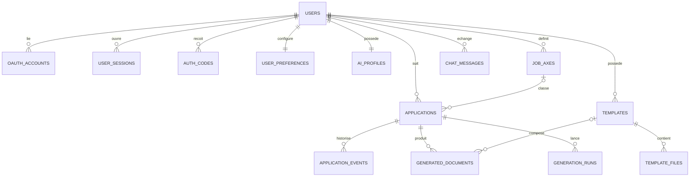

# Conception BDD PostgreSQL V1

> [!abstract] Objectif
> Transformer le document NoSQL exploratoire en un modele relationnel PostgreSQL coherent, contraint et directement traduisible en migrations.

## 1. Decisions techniques

### SGBD retenu : PostgreSQL

PostgreSQL convient au projet parce que BotJob contient surtout des relations fortes :

- un utilisateur possede des axes de recherche, des templates et des candidatures ;
- une candidature possede un historique et des documents generes ;
- les comptes, sessions et codes de verification exigent des contraintes fiables ;
- certains blocs souples, comme le profil IA, peuvent rester en `JSONB` sans imposer une structure prematuree.

La V1 utilisera donc :

- des colonnes SQL classiques pour les donnees recherchees, filtrees ou reliees ;
- `JSONB` uniquement pour les structures flexibles ;
- des UUID pour ne pas exposer des identifiants incrementaux ;
- `TIMESTAMPTZ` pour conserver des dates non ambigues ;
- des contraintes `CHECK`, `UNIQUE` et des cles etrangeres ;
- la recherche plein texte PostgreSQL pour les candidatures.

L'ORM et l'outil de migration ne sont pas encore choisis. Le schema reste du SQL PostgreSQL standard afin de ne pas faire dependre la conception d'une bibliotheque TypeScript.

### Perimetre volontairement exclu de la V1

Les elements suivants ne justifient pas encore une table :

- etat du compte a rebours `createCvOverlay` ;
- formulaire rapide du dashboard ;
- colonnes temporairement masquees sans enregistrement explicite ;
- progression visuelle d'une generation IA ;
- fournisseurs et modeles IA, configures cote serveur ;
- export ponctuel d'un tableau ;
- paiement ;
- suppression RGPD automatisee ;
- Scrappeur BotJob ;
- versions annulables du profil IA ;
- conversations IA multiples.

## 2. Passage du document NoSQL au relationnel

| Bloc NoSQL | Destination SQL | Choix |
| --- | --- | --- |
| `user`, `auth` | `users`, `oauth_accounts`, `user_sessions`, `auth_codes` | Separation des secrets, identites externes et sessions |
| `preferences`, `tableView` | `user_preferences` | Une vue enregistree en V1, modifiee uniquement par action explicite |
| `aiProfile`, `customInstructions`, `lifeTrace` | `ai_profiles` | Un profil par utilisateur, parties flexibles en `JSONB` |
| `jobSearchAxes` | `job_axes` | Plusieurs axes actifs par utilisateur |
| `templates`, `sourceFiles` | `templates`, `template_files` | Metadonnees et fichiers separes |
| `applications` | `applications` | Donnees courantes directement filtrables |
| `followUps`, `interviews`, `history` | `application_events` | Un historique chronologique extensible |
| `generatedDocuments` | `generated_documents` | Documents versionnes par candidature |
| `generationRuns` | `generation_runs` | Trace des generations lancees |
| messages assistant | `chat_messages` | Historique V1 sans table de conversation |

## 3. Modele conceptuel



## 4. Responsabilite des tables

| Table | Responsabilite |
| --- | --- |
| `users` | Identite, connexion locale, profil obligatoire et avatar choisi |
| `oauth_accounts` | Liaison d'un compte Google ou Apple a un utilisateur |
| `user_sessions` | Sessions longues cote serveur, revocables individuellement |
| `auth_codes` | Codes temporaires de verification d'email ou reinitialisation |
| `user_preferences` | Theme, statistiques du dashboard et vue de tableau sauvegardee |
| `ai_profiles` | Profil maitre IA, consignes personnalisees et trace de vie |
| `job_axes` | Titres d'emploi recherches et criteres associes |
| `templates` | Templates de CV et de lettres de motivation |
| `template_files` | PDF, images ou autres fichiers sources d'un template |
| `applications` | Etat actuel et contenu complet d'une candidature |
| `application_events` | Relances, entretiens, actions et changements historiques |
| `generated_documents` | CV, lettres et messages generes, avec versions |
| `generation_runs` | Demandes de generation et leur resultat technique |
| `chat_messages` | Messages du dashboard et du mini-chat Studio IA |

## 5. Schema SQL propose

```sql
CREATE EXTENSION IF NOT EXISTS pgcrypto;

CREATE TABLE users (
    id UUID PRIMARY KEY DEFAULT gen_random_uuid(),
    username TEXT NOT NULL,
    email TEXT NOT NULL,
    password_hash TEXT,
    email_verified_at TIMESTAMPTZ,
    first_name TEXT NOT NULL,
    last_name TEXT NOT NULL,
    phone_country_code TEXT NOT NULL,
    phone_number TEXT NOT NULL,
    phone_verified_at TIMESTAMPTZ,
    avatar_id TEXT NOT NULL,
    status TEXT NOT NULL DEFAULT 'pending_email_verification'
        CHECK (status IN (
            'pending_email_verification',
            'active',
            'disabled',
            'deletion_requested'
        )),
    created_at TIMESTAMPTZ NOT NULL DEFAULT now(),
    updated_at TIMESTAMPTZ NOT NULL DEFAULT now()
);

CREATE UNIQUE INDEX users_username_lower_uq ON users (lower(username));
CREATE UNIQUE INDEX users_email_lower_uq ON users (lower(email));

CREATE TABLE oauth_accounts (
    id UUID PRIMARY KEY DEFAULT gen_random_uuid(),
    user_id UUID NOT NULL REFERENCES users(id) ON DELETE CASCADE,
    provider TEXT NOT NULL CHECK (provider IN ('google', 'apple')),
    provider_user_id TEXT NOT NULL,
    provider_email TEXT,
    scopes TEXT[] NOT NULL DEFAULT '{}',
    profile_snapshot JSONB NOT NULL DEFAULT '{}'::jsonb,
    linked_at TIMESTAMPTZ NOT NULL DEFAULT now(),
    last_login_at TIMESTAMPTZ,
    UNIQUE (provider, provider_user_id),
    UNIQUE (user_id, provider)
);

CREATE TABLE user_sessions (
    id UUID PRIMARY KEY DEFAULT gen_random_uuid(),
    user_id UUID NOT NULL REFERENCES users(id) ON DELETE CASCADE,
    session_token_hash TEXT NOT NULL UNIQUE,
    user_agent TEXT,
    ip_hash TEXT,
    created_at TIMESTAMPTZ NOT NULL DEFAULT now(),
    last_seen_at TIMESTAMPTZ NOT NULL DEFAULT now(),
    expires_at TIMESTAMPTZ NOT NULL,
    revoked_at TIMESTAMPTZ,
    CHECK (expires_at > created_at)
);

CREATE INDEX user_sessions_active_idx
    ON user_sessions (user_id, expires_at)
    WHERE revoked_at IS NULL;

CREATE TABLE auth_codes (
    id UUID PRIMARY KEY DEFAULT gen_random_uuid(),
    user_id UUID NOT NULL REFERENCES users(id) ON DELETE CASCADE,
    purpose TEXT NOT NULL
        CHECK (purpose IN ('email_verification', 'password_reset')),
    code_hash TEXT NOT NULL,
    attempts SMALLINT NOT NULL DEFAULT 0 CHECK (attempts >= 0),
    created_at TIMESTAMPTZ NOT NULL DEFAULT now(),
    expires_at TIMESTAMPTZ NOT NULL,
    used_at TIMESTAMPTZ,
    CHECK (expires_at > created_at)
);

CREATE INDEX auth_codes_pending_idx
    ON auth_codes (user_id, purpose, expires_at DESC)
    WHERE used_at IS NULL;

CREATE TABLE user_preferences (
    user_id UUID PRIMARY KEY REFERENCES users(id) ON DELETE CASCADE,
    theme TEXT NOT NULL DEFAULT 'dark'
        CHECK (theme IN ('light', 'dark', 'system')),
    dashboard_primary_period TEXT NOT NULL DEFAULT 'month'
        CHECK (dashboard_primary_period IN ('week', 'month', 'quarter', 'lifetime')),
    dashboard_secondary_period TEXT NOT NULL DEFAULT 'week'
        CHECK (dashboard_secondary_period IN ('week', 'month', 'quarter', 'lifetime')),
    saved_application_view JSONB NOT NULL DEFAULT '{}'::jsonb,
    updated_at TIMESTAMPTZ NOT NULL DEFAULT now()
);

CREATE TABLE ai_profiles (
    user_id UUID PRIMARY KEY REFERENCES users(id) ON DELETE CASCADE,
    sections JSONB NOT NULL DEFAULT '{}'::jsonb,
    custom_instructions TEXT NOT NULL DEFAULT '',
    life_trace JSONB NOT NULL DEFAULT '[]'::jsonb,
    updated_at TIMESTAMPTZ NOT NULL DEFAULT now(),
    CHECK (jsonb_typeof(sections) = 'object'),
    CHECK (jsonb_typeof(life_trace) = 'array')
);

CREATE TABLE job_axes (
    id UUID PRIMARY KEY DEFAULT gen_random_uuid(),
    user_id UUID NOT NULL REFERENCES users(id) ON DELETE CASCADE,
    title TEXT NOT NULL,
    description TEXT NOT NULL DEFAULT '',
    contract_types TEXT[] NOT NULL DEFAULT '{}',
    locations JSONB NOT NULL DEFAULT '[]'::jsonb,
    priority SMALLINT NOT NULL DEFAULT 0 CHECK (priority >= 0),
    is_active BOOLEAN NOT NULL DEFAULT true,
    created_at TIMESTAMPTZ NOT NULL DEFAULT now(),
    updated_at TIMESTAMPTZ NOT NULL DEFAULT now(),
    CHECK (jsonb_typeof(locations) = 'array')
);

CREATE UNIQUE INDEX job_axes_user_title_lower_uq
    ON job_axes (user_id, lower(title));

CREATE INDEX job_axes_active_idx
    ON job_axes (user_id, priority DESC)
    WHERE is_active = true;

CREATE TABLE templates (
    id UUID PRIMARY KEY DEFAULT gen_random_uuid(),
    user_id UUID NOT NULL REFERENCES users(id) ON DELETE CASCADE,
    kind TEXT NOT NULL CHECK (kind IN ('cv', 'cover_letter')),
    name TEXT NOT NULL,
    description TEXT NOT NULL DEFAULT '',
    source_format TEXT NOT NULL
        CHECK (source_format IN ('html_css', 'pdf', 'image', 'mixed')),
    html_content TEXT,
    css_content TEXT,
    preview_image_path TEXT,
    is_ats_one_column BOOLEAN NOT NULL DEFAULT true,
    is_default BOOLEAN NOT NULL DEFAULT false,
    created_at TIMESTAMPTZ NOT NULL DEFAULT now(),
    updated_at TIMESTAMPTZ NOT NULL DEFAULT now(),
    deleted_at TIMESTAMPTZ
);

CREATE UNIQUE INDEX templates_one_default_uq
    ON templates (user_id, kind)
    WHERE is_default = true AND deleted_at IS NULL;

CREATE INDEX templates_user_kind_idx
    ON templates (user_id, kind, updated_at DESC)
    WHERE deleted_at IS NULL;

CREATE TABLE template_files (
    id UUID PRIMARY KEY DEFAULT gen_random_uuid(),
    template_id UUID NOT NULL REFERENCES templates(id) ON DELETE CASCADE,
    original_name TEXT NOT NULL,
    mime_type TEXT NOT NULL,
    storage_path TEXT NOT NULL,
    size_bytes BIGINT CHECK (size_bytes IS NULL OR size_bytes >= 0),
    uploaded_at TIMESTAMPTZ NOT NULL DEFAULT now()
);

CREATE INDEX template_files_template_idx ON template_files (template_id);

CREATE TABLE applications (
    id UUID PRIMARY KEY DEFAULT gen_random_uuid(),
    user_id UUID NOT NULL REFERENCES users(id) ON DELETE CASCADE,
    job_axis_id UUID REFERENCES job_axes(id) ON DELETE SET NULL,

    status TEXT NOT NULL DEFAULT 'draft'
        CHECK (status IN (
            'draft',
            'preparing',
            'applied',
            'interview',
            'offer_received',
            'rejected',
            'withdrawn',
            'archived'
        )),

    company_name TEXT NOT NULL,
    company_website_url TEXT,
    job_title TEXT NOT NULL,
    contract_type TEXT,
    location TEXT,
    remote_mode TEXT NOT NULL DEFAULT 'unspecified'
        CHECK (remote_mode IN ('onsite', 'hybrid', 'remote', 'unspecified')),

    offer_url TEXT,
    offer_published_at TIMESTAMPTZ,
    offer_captured_at TIMESTAMPTZ NOT NULL DEFAULT now(),
    offer_full_text TEXT NOT NULL,
    offer_summary TEXT,
    source_platform TEXT,
    applied_at TIMESTAMPTZ,

    internal_contact_name TEXT,
    internal_contact_role TEXT,
    internal_contact_email TEXT,
    internal_contact_phone TEXT,
    internal_contact_linkedin_url TEXT,
    internal_contact_notes TEXT,
    remarks TEXT NOT NULL DEFAULT '',

    last_action_label TEXT,
    last_action_at TIMESTAMPTZ,
    last_action_author TEXT
        CHECK (last_action_author IS NULL OR last_action_author IN ('user', 'assistant', 'system')),
    next_action_label TEXT,
    next_action_at TIMESTAMPTZ,
    next_action_generated_by_ai BOOLEAN NOT NULL DEFAULT false,

    search_text TEXT NOT NULL DEFAULT '',
    search_vector TSVECTOR GENERATED ALWAYS AS (
        to_tsvector('simple'::regconfig, coalesce(search_text, ''))
    ) STORED,

    created_at TIMESTAMPTZ NOT NULL DEFAULT now(),
    updated_at TIMESTAMPTZ NOT NULL DEFAULT now()
);

CREATE INDEX applications_user_recent_idx
    ON applications (user_id, applied_at DESC NULLS LAST, created_at DESC);

CREATE INDEX applications_user_status_idx
    ON applications (user_id, status, updated_at DESC);

CREATE INDEX applications_job_axis_idx
    ON applications (job_axis_id)
    WHERE job_axis_id IS NOT NULL;

CREATE INDEX applications_search_idx
    ON applications USING GIN (search_vector);

CREATE TABLE application_events (
    id UUID PRIMARY KEY DEFAULT gen_random_uuid(),
    application_id UUID NOT NULL REFERENCES applications(id) ON DELETE CASCADE,
    event_type TEXT NOT NULL,
    label TEXT NOT NULL,
    content TEXT NOT NULL DEFAULT '',
    occurred_at TIMESTAMPTZ,
    planned_at TIMESTAMPTZ,
    state TEXT NOT NULL DEFAULT 'recorded'
        CHECK (state IN ('suggested', 'planned', 'recorded', 'completed', 'ignored', 'cleared')),
    author TEXT NOT NULL CHECK (author IN ('user', 'assistant', 'system')),
    metadata JSONB NOT NULL DEFAULT '{}'::jsonb,
    created_at TIMESTAMPTZ NOT NULL DEFAULT now(),
    CHECK (jsonb_typeof(metadata) = 'object')
);

CREATE INDEX application_events_timeline_idx
    ON application_events (application_id, occurred_at DESC NULLS LAST, created_at DESC);

CREATE INDEX application_events_upcoming_idx
    ON application_events (application_id, planned_at)
    WHERE planned_at IS NOT NULL AND state IN ('suggested', 'planned');

CREATE TABLE generated_documents (
    id UUID PRIMARY KEY DEFAULT gen_random_uuid(),
    application_id UUID NOT NULL REFERENCES applications(id) ON DELETE CASCADE,
    template_id UUID REFERENCES templates(id) ON DELETE SET NULL,
    kind TEXT NOT NULL CHECK (kind IN ('cv', 'cover_letter', 'approach_message')),
    version INTEGER NOT NULL CHECK (version > 0),
    title TEXT NOT NULL,
    content_text TEXT,
    html_content TEXT,
    css_content TEXT,
    pdf_path TEXT,
    is_ats_one_column BOOLEAN NOT NULL DEFAULT true,
    generated_at TIMESTAMPTZ NOT NULL DEFAULT now(),
    UNIQUE (application_id, kind, version)
);

CREATE INDEX generated_documents_application_idx
    ON generated_documents (application_id, kind, version DESC);

CREATE TABLE generation_runs (
    id UUID PRIMARY KEY DEFAULT gen_random_uuid(),
    application_id UUID NOT NULL REFERENCES applications(id) ON DELETE CASCADE,
    status TEXT NOT NULL DEFAULT 'queued'
        CHECK (status IN ('queued', 'running', 'completed', 'failed', 'cancelled')),
    can_ai_edit_cv_structure BOOLEAN NOT NULL DEFAULT false,
    include_cv BOOLEAN NOT NULL DEFAULT true,
    include_cover_letter BOOLEAN NOT NULL DEFAULT false,
    include_approach_message BOOLEAN NOT NULL DEFAULT false,
    started_at TIMESTAMPTZ,
    finished_at TIMESTAMPTZ,
    error_message TEXT,
    created_at TIMESTAMPTZ NOT NULL DEFAULT now(),
    CHECK (include_cv OR include_cover_letter OR include_approach_message),
    CHECK (finished_at IS NULL OR started_at IS NULL OR finished_at >= started_at)
);

CREATE INDEX generation_runs_application_idx
    ON generation_runs (application_id, created_at DESC);

CREATE TABLE chat_messages (
    id UUID PRIMARY KEY DEFAULT gen_random_uuid(),
    user_id UUID NOT NULL REFERENCES users(id) ON DELETE CASCADE,
    channel TEXT NOT NULL CHECK (channel IN ('dashboard', 'studio')),
    role TEXT NOT NULL CHECK (role IN ('user', 'assistant', 'system')),
    content TEXT NOT NULL,
    tool_calls JSONB NOT NULL DEFAULT '[]'::jsonb,
    result_summary TEXT,
    created_at TIMESTAMPTZ NOT NULL DEFAULT now(),
    CHECK (jsonb_typeof(tool_calls) = 'array')
);

CREATE INDEX chat_messages_history_idx
    ON chat_messages (user_id, channel, created_at DESC);
```

## 6. Choix particuliers expliques

### Vue du tableau en `JSONB`

`saved_application_view` peut contenir :

```json
{
  "columnOrder": ["jobTitle", "company", "status", "appliedAt"],
  "hiddenColumns": ["internalContactPhone"],
  "filters": {"status": ["applied", "interview"]},
  "sort": {"field": "appliedAt", "direction": "desc"},
  "density": "comfortable"
}
```

La densite indique seulement la hauteur visuelle des lignes : compacte, confortable ou spacieuse. Le front peut modifier cette configuration temporairement. Elle n'est envoyee au backend que lorsque l'utilisateur clique sur **Enregistrer la vue**.

### Profil IA en `JSONB`

Les rubriques du profil maitre IA vont evoluer. Les figer immediatement dans une dizaine de tables rendrait chaque changement couteux. La colonne `sections` peut contenir des blocs comme les formations, experiences, projets et competences, tout en gardant `custom_instructions` dans un texte unique facile a injecter dans les prompts.

### Evenements de candidature

`application_events` remplace plusieurs listes presque identiques. `event_type` peut prendre des valeurs comme :

- `follow_up`;
- `interview`;
- `status_change`;
- `last_action_change`;
- `next_action_suggestion`;
- `note`;
- `assistant_update`.

Une modification manuelle de la derniere action doit :

1. ajouter l'ancienne et la nouvelle valeur dans `application_events` ;
2. mettre a jour la derniere action dans `applications` ;
3. vider la prochaine action courante ;
4. enregistrer l'ancienne prochaine action avec l'etat `cleared`.

### Recherche des candidatures

Le backend construit `applications.search_text` avec les donnees courtes utiles :

- poste et entreprise ;
- localisation et contrat ;
- statut et dates ;
- axe de recherche ;
- contacts ;
- relances, entretiens, remarques et actions.

Le texte complet de l'offre, les CV et les lettres sont exclus pour eviter des resultats trop bruyants. PostgreSQL genere ensuite automatiquement `search_vector`, indexe avec GIN. La configuration `simple` conserve mieux les termes techniques et anglophones qu'une analyse uniquement francaise.

### HTML et CSS separes

Le HTML decrit le contenu et la structure ; le CSS decrit la mise en page et le design. Les stocker separement facilite :

- l'interdiction de modifier la structure quand l'utilisateur refuse ;
- l'edition du style sans reconstruire le contenu ;
- la validation du CSS classique et l'interdiction de Tailwind ;
- la generation d'une previsualisation.

`preview_image_path` pointe vers une miniature generee. Elle permet d'afficher rapidement la bibliotheque sans rendre chaque template complet dans le navigateur.

### Sessions et OAuth

Le cookie du navigateur contient un jeton de session aleatoire. La BDD ne stocke que `session_token_hash`. En cas de fuite de la base, le jeton directement utilisable n'est donc pas present.

`ip_hash` est un signal secondaire de securite et de diagnostic. Il peut aider a detecter un changement inhabituel ou presenter les sessions actives, mais il ne doit jamais bloquer seul un utilisateur : les IP changent frequemment. Une valeur salee et tronquee limite la conservation d'une donnee reseau brute.

OAuth ne produit pas un "hash OAuth" propre a BotJob. Le fournisseur renvoie un identifiant stable, conserve dans `provider_user_id`. Les jetons Google ou Apple ne sont pas conserves si BotJob n'appelle pas leurs API apres la connexion.

## 7. Requetes principales

### Candidatures recentes du dashboard

```sql
SELECT
    id,
    offer_url,
    job_title,
    company_name,
    location,
    applied_at
FROM applications
WHERE user_id = $1
ORDER BY applied_at DESC NULLS LAST, created_at DESC
LIMIT 10;
```

Le front en affiche cinq a la fois et rend le bloc scrollable.

### Recherche rapide

```sql
SELECT
    id,
    job_title,
    company_name,
    location,
    status,
    applied_at
FROM applications
WHERE user_id = $1
  AND search_vector @@ websearch_to_tsquery('simple', $2)
ORDER BY applied_at DESC NULLS LAST;
```

### Historique d'une candidature

```sql
SELECT
    event_type,
    label,
    content,
    occurred_at,
    planned_at,
    state,
    author
FROM application_events
WHERE application_id = $1
ORDER BY occurred_at DESC NULLS LAST, created_at DESC;
```

### Statistiques du dashboard

```sql
SELECT count(*) AS application_count
FROM applications
WHERE user_id = $1
  AND applied_at >= $2
  AND applied_at < $3;
```

Les bornes sont calculees par le backend selon la periode choisie : semaine, mois, trimestre ou duree de vie du compte.

## 8. Regles d'implementation

- Le backend controle toujours que la ressource appartient a l'utilisateur connecte.
- Le mot de passe, les codes et les jetons de session ne sont jamais stockes en clair.
- `updated_at` est mis a jour par les services metier lors de chaque modification.
- Une suppression de template est logique via `deleted_at`.
- Le contenu complet de l'offre est conserve meme si le lien externe disparait.
- Le premier avatar est attribue une seule fois a l'inscription, puis change uniquement par l'utilisateur.
- La vue du tableau n'est persistee que sur action explicite.
- Le champ de prochaine action est une suggestion IA modifiable par l'utilisateur.
- Les fichiers sont stockes hors de PostgreSQL ; la BDD conserve leurs chemins et metadonnees.
- Les styles de templates utilisent du CSS classique, sans Tailwind.

## 9. Points a decider avant les migrations

1. Choisir l'hebergeur PostgreSQL et le stockage des fichiers.
2. Choisir l'outil de migration compatible Bun et TypeScript.
3. Definir le format JSON exact de `ai_profiles.sections`.
4. Definir le format JSON exact de `job_axes.locations`.
5. Fixer les durees de vie des sessions et codes d'authentification.

## 10. Etat de validation

Le modele couvre les parcours V1 documentes et remplace le bloc NoSQL exploratoire comme reference de conception. Le SQL n'a pas encore ete execute localement, car le client `psql` n'est pas installe dans l'environnement actuel. Il devra etre valide par une migration sur une instance PostgreSQL de developpement avant implementation du backend.

## Sources techniques

- [PostgreSQL - Types JSON](https://www.postgresql.org/docs/current/datatype-json.html)
- [PostgreSQL - Recherche plein texte dans les tables](https://www.postgresql.org/docs/current/textsearch-tables.html)
- [PostgreSQL - Contraintes](https://www.postgresql.org/docs/current/ddl-constraints.html)
- [PostgreSQL - Types d'index](https://www.postgresql.org/docs/current/indexes-types.html)
